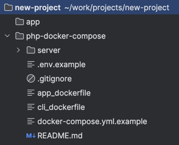

## Как использовать
- создайте папку для проекта (например new-project), если уже создана, пропустите этот пункт
- скопируйте этот пакет в папку через `git clone`
- создайте папку app для кода, если код уже есть перенесите его в эту папку (в дальнейшем путь к проекту можно изменить, как это сделать написано в следующем разделе)
- итоговый вариант должен выглядеть так

## Настройка докера
- скопируйте файл .env.example в .env, управление докером ведется через него
- скопируйте docker-compose.yml.example в docker-compose.yml, вносить изменения в файл примера запрещено
- папка проекта по умолчанию называется client, если хотите поменять, смотрите следующий пункт
- для изменения папки проекта измените значение `APP_CODE_PATH_HOST`
- в значение `COMPOSE_PROJECT_NAME` обязательно укажите название проекта, он повлияет на названия контейнеров, образов и сетей
- в значение `PHP_VERSION` укажите требуемую версию php
- остальные значения меняйте на свой страх и риск
- по умолчанию включена установка следующих пакетов: composer, xdebug

## Настройка nginx
- в папке nginx/conf.d скопируйте файл app.conf.example в app.conf
- обновите значение `server_name` на то которое хотите использовать

## Настройка php.ini
- в папке server/php если примеры файлов для php.ini, скопируйте и переименуйте ini файл с шаблоном по следующему примеру `php-${PHP_VERSION}-${APP_ENV}.ini`, например php-8.2-local.ini

## FAQ
- если хотите добавить новых сервисов: добавьте какие хотите, главное не docker-compose.yml.example
- если у вас уже есть образ: используйте второй пример app, а первый закомментируйте
